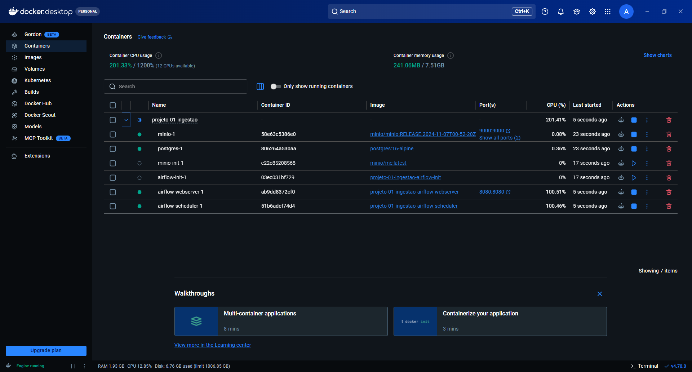
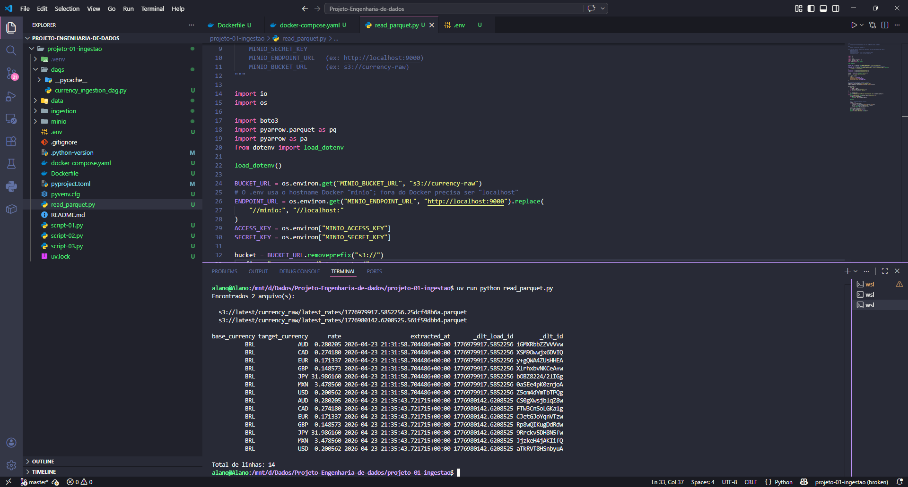

# 💱 Currency Ingestion Pipeline

Pipeline de ingestão horária de cotações de câmbio da [FreeCurrency API](https://freecurrencyapi.com) para um Data Lake local (MinIO) em formato Parquet, orquestrada pelo Apache Airflow — tudo rodando localmente via Docker Compose.

---

## 🎯 Objetivo

Construir um pipeline de dados ponta-a-ponta que coleta cotações do Real Brasileiro (BRL) em tempo real contra moedas internacionais (USD, EUR, JPY, GBP, CAD, AUD, MXN), armazena os dados em formato Parquet no MinIO e executa automaticamente a cada hora via Apache Airflow.

---

## 🏗️ Arquitetura

```
FreeCurrency API → Python (dlt) → MinIO (Data Lake)
                                        ↑
                              Apache Airflow (orquestração)
```

O fluxo completo:

1. O **Airflow** dispara a DAG `freecurrency_hourly_ingestion` a cada hora
2. A DAG executa a task `run_dlt_pipeline`
3. O **dlt** chama a FreeCurrency API via `source.py`
4. Os dados são normalizados e escritos como **Parquet** no **MinIO**
5. Os arquivos ficam disponíveis em `s3://latest/currency_raw/latest_rates/`

---

## 🛠️ Stack Tecnológica

| Componente | Função |
|---|---|
| **Python 3.11** | Linguagem principal |
| **dlt (dlthub)** | Ingestão, normalização e escrita Parquet |
| **Apache Airflow 2.9** | Orquestração e scheduling horário |
| **MinIO** | Object storage S3-compatible (Data Lake local) |
| **PostgreSQL** | Backend de metadados do Airflow |
| **Docker Compose** | Ambiente local completo e reproduzível |
| **uv** | Gerenciador de dependências e lockfile |

---

## 📂 Estrutura do Repositório

```
projeto-01-ingestao/
│
├── dags/
│   └── currency_ingestion_dag.py   ← DAG horária do Airflow
│
├── ingestion/
│   ├── __init__.py
│   ├── source.py                   ← dlt source (chama a FreeCurrency API)
│   └── pipeline.py                 ← dlt pipeline (grava no MinIO)
│
├── scripts/
│   ├── script-01.py                ← Teste simples da API via requests
│   ├── script-02.py                ← Pipeline dlt para filesystem local
│   ├── script-03.py                ← Pipeline dlt para MinIO (S3)
│   └── read_parquet.py             ← Leitura e validação dos arquivos Parquet
│
├── img/                            ← Imagens do projeto
├── .env.example                    ← Template de variáveis de ambiente
├── .gitignore
├── Dockerfile                      ← Imagem customizada do Airflow com dependências
├── docker-compose.yaml             ← Orquestração de todos os serviços
├── pyproject.toml                  ← Dependências do projeto
└── uv.lock                         ← Lockfile gerado pelo uv
```

---

## 🚀 Como Executar

### Pré-requisitos

- Docker e Docker Compose instalados
- Conta gratuita na [FreeCurrency API](https://freecurrencyapi.com) para obter a API key

### 1. Clone o repositório

```bash
git clone https://github.com/alanoregis/Projeto-Engenharia-de-Dados.git
cd Projeto-Engenharia-de-Dados
```

### 2. Configure as variáveis de ambiente

```bash
cp .env.example .env
# Edite o .env com suas credenciais
```

Variáveis necessárias:

```env
API_KEY=sua_chave_freecurrency

MINIO_ACCESS_KEY=seu_usuario
MINIO_SECRET_KEY=sua_senha
MINIO_ENDPOINT_URL=http://minio:9000
MINIO_BUCKET_URL=s3://latest
```

### 3. Suba o ambiente

```bash
# Build da imagem com as dependências instaladas
docker compose build

# Inicialização do banco de metadados do Airflow (rodar apenas uma vez)
docker compose up airflow-init

# Sobe todos os serviços em background
docker compose up -d
```

### 4. Acesse as interfaces

| Serviço | URL | Credencial |
|---|---|---|
| Airflow UI | http://localhost:8080 | admin / admin |
| MinIO Console | http://localhost:9001 | conforme `.env` |

### 5. Ative a DAG

No Airflow UI, ative a DAG `freecurrency_hourly_ingestion` e dispare manualmente para testar o primeiro run.

### 6. Valide os dados

```bash
uv run python scripts/read_parquet.py
```

---

## 📸 Resultados

### Containers rodando via Docker



Todos os serviços sobem com um único `docker compose up -d` — Airflow, MinIO e PostgreSQL.

### DAG no Airflow — execuções com sucesso


A DAG roda a cada hora (cron `0 * * * *`) com 3 tentativas automáticas em caso de falha. Tempo médio de execução: ~10 segundos.

### Arquivos Parquet no MinIO


Cada execução gera um arquivo Parquet identificado pelo `load_id` do dlt, garantindo rastreabilidade completa. Os arquivos ficam em `latest/currency_raw/latest_rates/`.

### Leitura dos dados via script




---

## 🗂️ Particionamento dos Dados

O dlt escreve os arquivos no seguinte padrão dentro do MinIO:

```
latest/
└── currency_raw/
    └── latest_rates/
        ├── <load_id_1>.parquet
        ├── <load_id_2>.parquet
        └── ...
```

Cada arquivo representa uma execução do pipeline, com `_dlt_load_id` e `_dlt_id` para rastreabilidade completa.

---

## 🔐 Variáveis de Ambiente

O `.env` nunca é commitado — está no `.gitignore`. As variáveis seguem a convenção do dlt:

| Variável | Descrição |
|---|---|
| `API_KEY` | Chave da FreeCurrency API |
| `MINIO_ACCESS_KEY` | Credencial de acesso ao MinIO |
| `MINIO_SECRET_KEY` | Credencial secreta do MinIO |
| `MINIO_ENDPOINT_URL` | Endpoint S3 do MinIO |
| `MINIO_BUCKET_URL` | Bucket de destino (`s3://latest`) |

---

## 👨‍💻 Autor

**Alano Regis Milfont** — Engenheiro de Dados Júnior | Analista de Dados

[](https://linkedin.com/in/alanoregis)
[](https://github.com/alanoregis)
[](mailto:alano.120.ar@gmail.com)

---

> *Projeto desenvolvido como prática de Engenharia de Dados com Python, Docker e Airflow *
